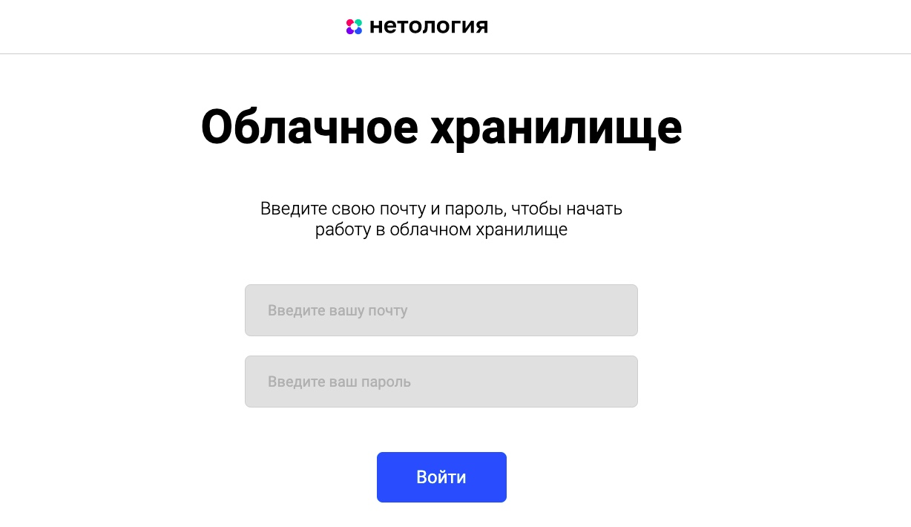

# **Дипломная работа «Облачное хранилище»**
## **Задача проекта**
Задача — разработать REST-сервис. Сервис должен предоставить REST-интерфейс для хранения, загрузки , удаления, скачивания и вывода списка уже загруженных файлов пользователя.

* Все запросы к сервису должны быть авторизованы. 
* Заранее подготовленное веб-приложение (FRONT) должно подключаться к разработанному сервису без доработок, а также использовать функционал FRONT для авторизации, загрузки и вывода списка файлов пользователя.


## **Требования к приложению**
1. Сервис должен предоставлять REST-интерфейс для интеграции с FRONT.
2. Сервис должен реализовывать все методы, описанные в [**yaml-файле**](https://github.com/netology-code/jd-homeworks/blob/master/diploma/CloudServiceSpecification.yaml):
 
 - Авторизация.
 - Добавление файла.
 - Вывод списка файлов.
 - Редактирование имени файла.
 - Удаление файла.
 - Загрузка файла. 
 

## **Реализация:**
* Приложение (REST-сервис) разработано с использованием **Spring Boot**
* Реализована авторизация с помощью **JWT-Token Authentication,
Spring Security, CORS.**
* База данных - **PostgreSQL**
* Сборщик пакетов - **maven**
* Для запуска используется **docker, docker-compose**
* Логирование  - **log4j** (Логируются операции - уровень INFO и ошибки -уровень ERROR).
Запись логов в файле **cloud.log**
* Протестирован с помощью **Postman**


## **1. Запуск BACKEND:**

###  Для запуска REST-сервиса необходимо выполнить сборку проекта в терминале:

```
./mvnw clean package
```  
или  
```
mvn install
```

И далее запустить проект командой:
```
docker-compose up
```
Backend проект запустится на порту **8091**

При запуске приложения, в базе автоматически создадутся :

**Tаблицы**:
* users,
* files,
* roles,
* user_roles

и 
**Стартовые пользователи:**
```
login: anna@gmail.com, password: anna
login: User1@mail.ru, password: user

```
Рекомендуется использовать их для тестирования


## **2. Описание и запуск FRONT:**
- Чтобы установить и запустить frontend следуйте [**инструкции**](https://github.com/AnnaGubkina/CloudStorage/tree/master/front/netology-diplom-frontend).  

- Проект запустится по ссылке http://localhost:8080/

При удачном запуске нашего REST-сервиса и Front приложения, по адресу http://localhost:8080/ откроется вот такой интерфейс:



При успешной авторизации, пользователь попадает в личный кабинет, где ему будет доступны функции добавления, удаления, скачивания и редактирования файлов. 

